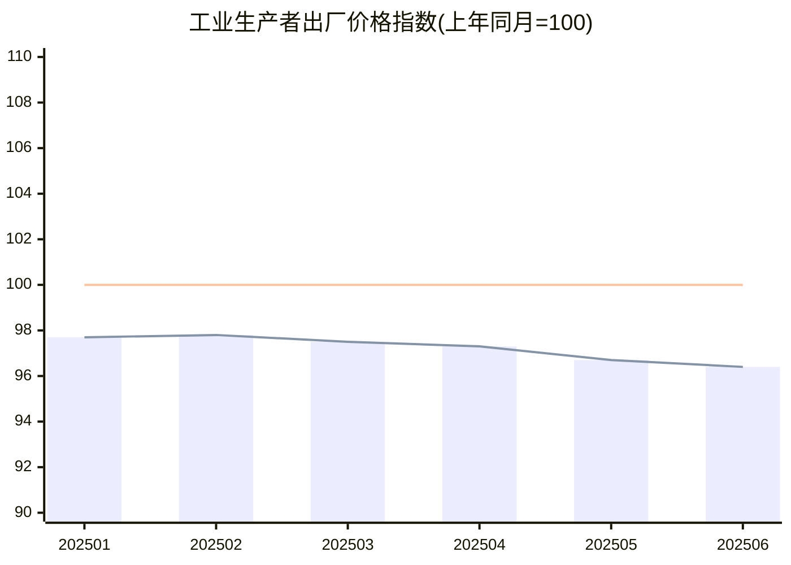
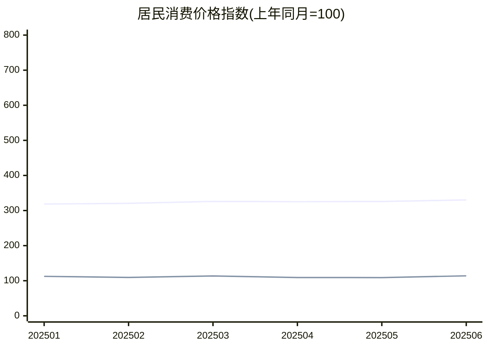
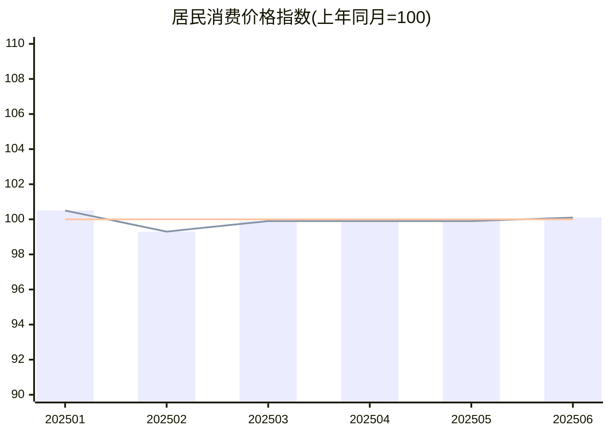

# 宏观经济跟踪

## PPI指标

## CPI指标

## M1 和 M2
### 2024年数据
| 单位（万亿） | 202401 | 202402 | 202403 | 202404 | 202405 | 202406 | 202407 | 202408 | 202409 | 202410 | 202411 | 202412 |
| :----------: | :----: | :----: | :----: | :----: | :----: | :----: | :----: | :----: | :----: | :----: | :----: | :----: |
| **M1**       | 69.42  | 66.59  | 68.58  | 66.01  | 64.68  | 66.06  | 63.23  | 63.02  | 62.82  | 63.34  | 65.09  | 67.10  |
| **M2**       | 297.63 | 299.56 | 304.80 | 301.19 | 301.85 | 305.02 | 303.31 | 305.05 | 309.48 | 309.71 | 311.96 | 313.53 |

### 2025年数据
| 单位（万亿） | 202501 | 202502 | 202503 | 202504 | 202505 | 202506 |
| :----------: | :----: | :----: | :----: | :----: | :----: | :----: |
| **M1**       | 112.45 | 109.44 | 113.49 | 109.14 | 108.91 | 113.95 |
| **M2**       | 318.52 | 320.52 | 326.06 | 325.17 | 325.78 | 330.29 |

### 同比增速
| 月份 | M1同比增速 | M2同比增速 | 剪刀差（M1-M2） |
| :--: | :--------: | :--------: | :-------------: |
| 1月  |   61.98%   |    7.02%   |     54.96%      |
| 2月  |   64.35%   |    6.99%   |     57.36%      |
| 3月  |   65.49%   |    6.98%   |     58.51%      |
| 4月  |   65.34%   |    7.96%   |     57.38%      |
| 5月  |   68.38%   |    7.93%   |     60.45%      |
| 6月  |   72.50%   |    8.29%   |     64.21%      |

# CPI指标

# 数据来源
- [国家统计局](https://www.stats.gov.cn/)  

- [中国人民银行](http://www.pbc.gov.cn/diaochatongjisi/116219/116319/5570903/5570886/index.html)